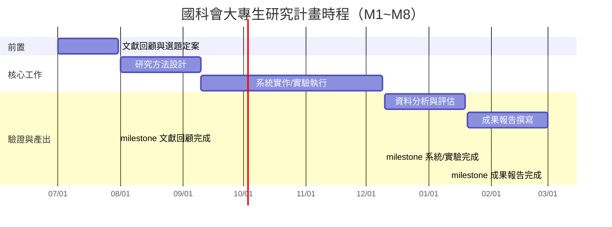

# 甘特圖生成 Prompt

## Prompt 1：8 個月研究時程甘特圖（Mermaid 格式）
```
請為國科會大專學生研究計畫（執行期 8 個月：7 月~隔年 2 月）建立甘特圖。
研究內容概述：[貼上研究方法摘要，含研究步驟]

需求：
1. 以 Mermaid gantt 語法輸出，可直接貼入 Markdown 渲染。
2. 里程碑（milestone）至少 3 個：文獻回顧完成、系統/實驗完成、成果報告完成。
3. 工作項依時間順序且充分並行（8 個月內可完成，切合大專生負擔）。
4. 每項工作標示月份（M1~M8，不含 6~8 月暑假限制，如適用請保留彈性）。

以下為框架範例：

請依我的研究內容重寫完整版本，並在表格中同步輸出「月份→工作項目→交付物」對照表。
```

## Prompt 2：甘特圖轉表格（若無法渲染圖）
```
若無法渲染 Mermaid，請將上述時程輸出為表格式甘特圖：

| 工作項目 | 起始月 | 結束月 | 交付物/里程碑 |
|---------|--------|--------|---------------|
| 文獻回顧 | M1 | M1 | 文獻矩陣、缺口分析 |

並以「■」填滿執行月、以「□」表示空月，輸出簡易視覺列。
```

## 使用守則
- 甘特圖時間必須與計畫執行期（8 個月）一致，頁數內含圖表以 10 頁為限。
- 里程碑清晰化是評審判斷可行性的關鍵；工作分解應對應研究方法章節的 Step 1~4。
